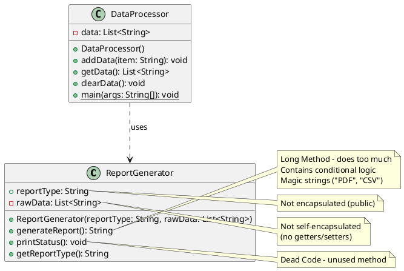

# Initial UML Class Diagram (Before Refactoring)

## Text-Based UML

```
┌─────────────────────────────────┐
│      ReportGenerator            │
├─────────────────────────────────┤
│ + reportType: String            │
│ - rawData: List<String>         │
├─────────────────────────────────┤
│ + ReportGenerator(String,       │
│     List<String>)                │
│ + generateReport(): String      │
│ + printStatus(): void           │
│ + getReportType(): String       │
└─────────────────────────────────┘

┌─────────────────────────────────┐
│      DataProcessor              │
├─────────────────────────────────┤
│ - data: List<String>            │
├─────────────────────────────────┤
│ + DataProcessor()               │
│ + addData(String): void         │
│ + getData(): List<String>       │
│ + clearData(): void             │
│ + main(String[]): void          │
└─────────────────────────────────┘

        uses
DataProcessor ────────> ReportGenerator
```

## PlantUML Format



## Code Smells Identified

1. **Long Method**: `generateReport()` method is too long and does multiple things
2. **Magic Strings**: Hardcoded "PDF" and "CSV" strings throughout the code
3. **Switch Statements/Conditional Logic**: Multiple if-else statements based on reportType
4. **Dead Code**: `printStatus()` method is never used
5. **Lack of Encapsulation**: `reportType` is public, `rawData` lacks getters/setters
6. **Feature Envy**: Report formatting logic is inside ReportGenerator rather than in specialized classes
7. **Violates SRP**: ReportGenerator does data processing AND formatting
8. **Violates OCP**: Adding new report type requires modifying existing code
