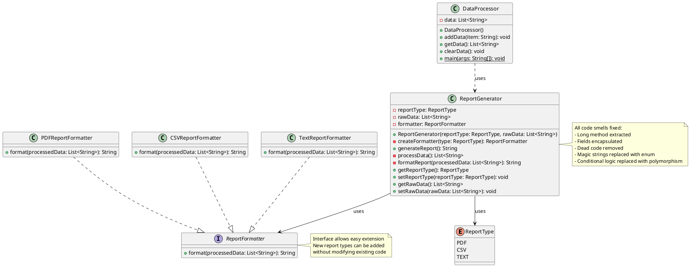

# Refactored UML Class Diagram (After Refactoring)

## Text-Based UML

```
┌──────────────────────────────┐
│   <<enumeration>>            │
│      ReportType              │
├──────────────────────────────┤
│ PDF                          │
│ CSV                          │
│ TEXT                         │
└──────────────────────────────┘

┌──────────────────────────────┐
│   <<interface>>              │
│    ReportFormatter           │
├──────────────────────────────┤
│ + format(List<String>):      │
│     String                   │
└──────────────────────────────┘
           △
           │ implements
  ┌────────┼────────┐
  │        │        │
┌─┴───┐  ┌─┴───┐  ┌─┴───┐
│PDF  │  │CSV  │  │Text │
│Fmt  │  │Fmt  │  │Fmt  │
└─────┘  └─────┘  └─────┘

┌─────────────────────────────────┐
│      ReportGenerator            │
├─────────────────────────────────┤
│ - reportType: ReportType        │
│ - rawData: List<String>         │
│ - formatter: ReportFormatter    │
├─────────────────────────────────┤
│ + ReportGenerator(ReportType,   │
│     List<String>)                │
│ - createFormatter(ReportType):  │
│     ReportFormatter              │
│ + generateReport(): String      │
│ - processData(): List<String>   │
│ - formatReport(List<String>):   │
│     String                       │
│ + getReportType(): ReportType   │
│ + setReportType(ReportType)     │
│ + getRawData(): List<String>    │
│ + setRawData(List<String>)      │
└─────────────────────────────────┘
           │
           │ uses
           ▼
┌─────────────────────────────────┐
│      DataProcessor              │
├─────────────────────────────────┤
│ - data: List<String>            │
├─────────────────────────────────┤
│ + DataProcessor()               │
│ + addData(String): void         │
│ + getData(): List<String>       │
│ + clearData(): void             │
│ + main(String[]): void          │
└─────────────────────────────────┘
```

## PlantUML Format



## Key Improvements

### 1. Design Patterns Applied
- **Strategy Pattern**: ReportFormatter interface with multiple implementations
- **Factory Pattern**: createFormatter() method

### 2. SOLID Principles Followed
- **Single Responsibility**: Each class has one clear responsibility
  - ReportGenerator: Manages data and coordinates report generation
  - PDFReportFormatter: Formats PDF reports only
  - CSVReportFormatter: Formats CSV reports only
  - TextReportFormatter: Formats TEXT reports only

- **Open/Closed Principle**: Open for extension, closed for modification
  - New report types can be added by creating new formatter classes
  - No need to modify ReportGenerator or existing formatters

- **Liskov Substitution**: All formatters can be used interchangeably
- **Interface Segregation**: Small, focused ReportFormatter interface
- **Dependency Inversion**: ReportGenerator depends on ReportFormatter abstraction

### 3. Structure Comparison
| Aspect | Before | After |
|--------|--------|-------|
| Classes | 2 | 7 (more focused) |
| Interfaces | 0 | 1 |
| Enums | 0 | 1 |
| Public Fields | 1 | 0 |
| Long Methods | 1 | 0 |
| Conditional Logic | Multiple if-else | Polymorphism |
| Dead Code | 1 method | 0 |
| Magic Strings | 2 | 0 |
